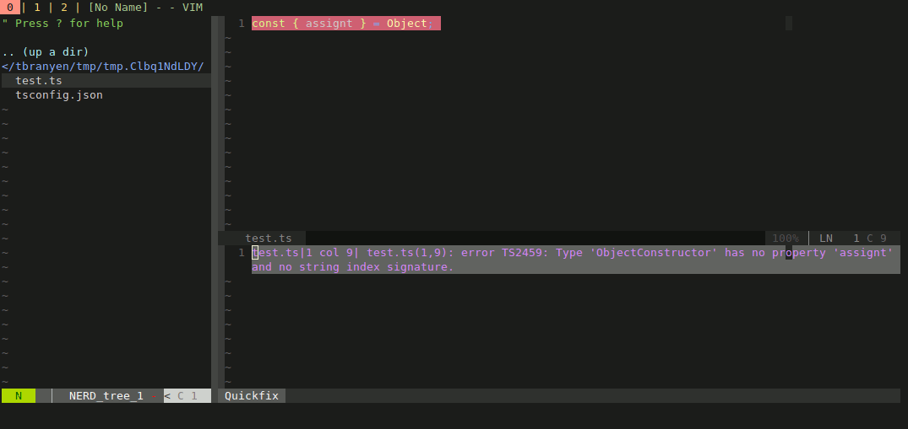

# TypeScript Plugin for VIM

<p align="center">
  
</p>

A fast plugin that runs the TypeScript compiler in the background and writing
output to the quickfix window.

**High level features:**

- Uses a locally installed TypeScript compiler, or the default built in.
- Asynchronously runs the TypeScript compiler behind-the-scenes.

Pairs great with [vim-hier](https://github.com/jceb/vim-hier)! This plugin
highlights Quickfix errors and will help you visually see where problems are.

## Installation

(TODO Pathogen / Vundle / vim-plug support...)

First clone the repo:

``` sh
git clone https://github.com/tbranyen/vim-typescript
```

Now symlink the plugin into your plugins folder:

``` sh
ln -s vim-typescript/plugin/typescript.vim ~/.vim/plugin/
```

Finally set a variable in your `.vimrc` pointing to the location of your
vim-typescript folder.

``` vimrc
" Example ~/.vimrc
let g:ts_path_to_plugin = '/path/to/vim-typescript/'
```

MIT License 2018
